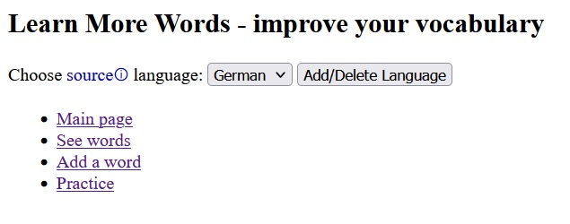
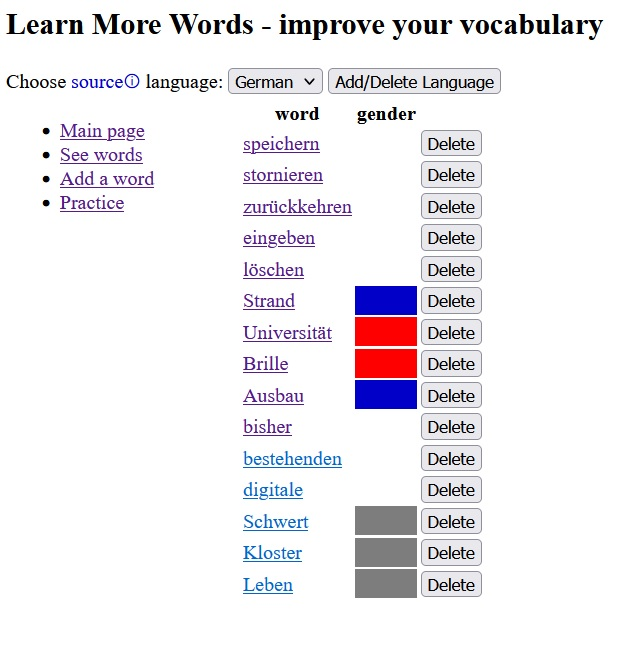
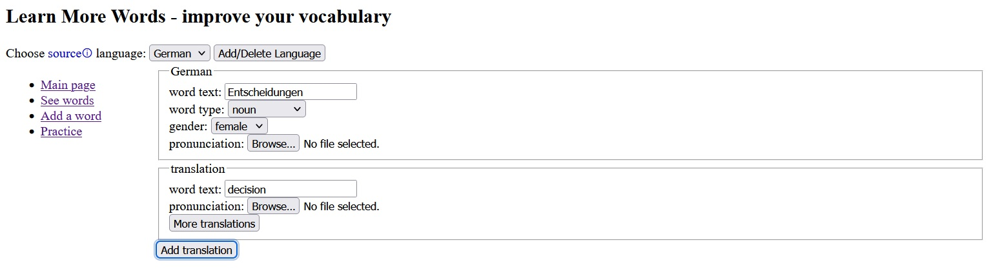
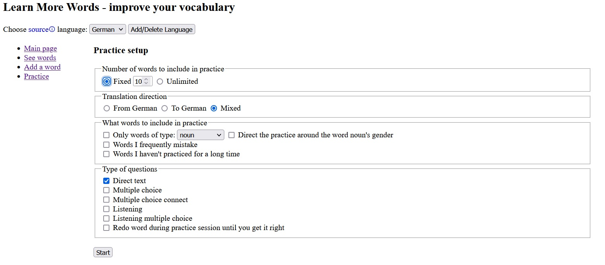
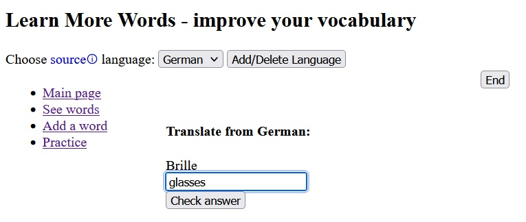
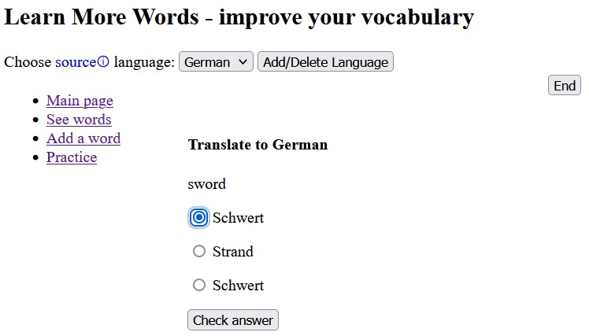
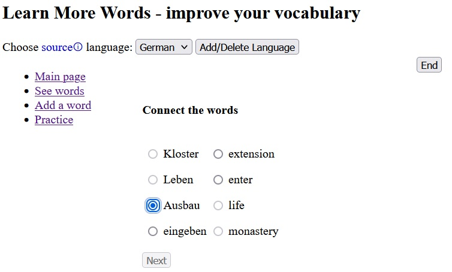

# lmw
Learn More Words - learn the grammar on Duolingo; customize the vocabulary you want to learn here

purpose: to help one learn more words  
The app is designed to work locally (localhost) through the default developer Django built-in server.  

run app by typing (in project's lmw dir containing manage.py):  
- python manage.py runserver  
open localhost:8000/dictionary in browser

programming language: Python + Django - see requirements.txt  
react - see package.json  
IDE: PyCharm Community, VSCode  

Target OS: Windows  

The functionality can be separated into 2 main parts:
- dictionary (add, view, edit words in dictionary)  
- practice (set up a practice session and practice)  

If fixed amount of words is selected in practice setup, the react frontend is activated.  
If unlimited words is selected in practice setup, everything happens in the backend (with django's templating language).  

screenshots of main functionality:
1. main menu (http://localhost:8000/dictionary/)  
  

2. view words for a specific language (http://localhost:8000/dictionary/German/words/)  
  

3. add new words into dictionary (http://localhost:8000/dictionary/German/forms/new_word/)  
  

4. practice setup (http://localhost:8000/practice/German/practice/)  
  

5. direct text exercise  
  
hidden keys: 0-plays audio for word (1-3 - selects gender radio, if exercise allows it)  

6. multiple choice exercise  
  
hidden keys: 0-plays audio for word, 1-3 - selects answer radio  

7. multiple choice connect exercise  
  
hidden keys: 1-4 - selects left word radio  

